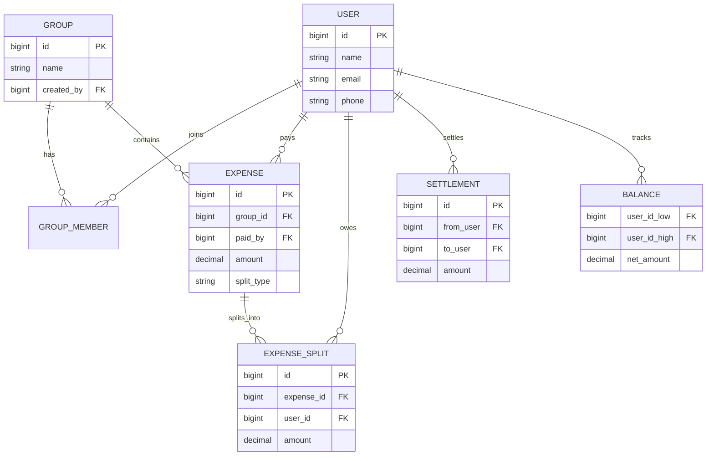
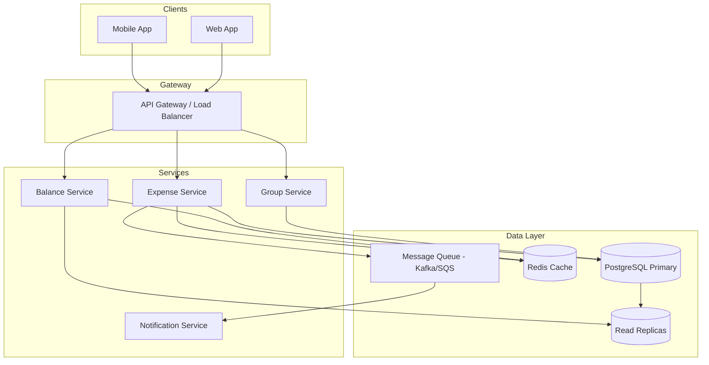
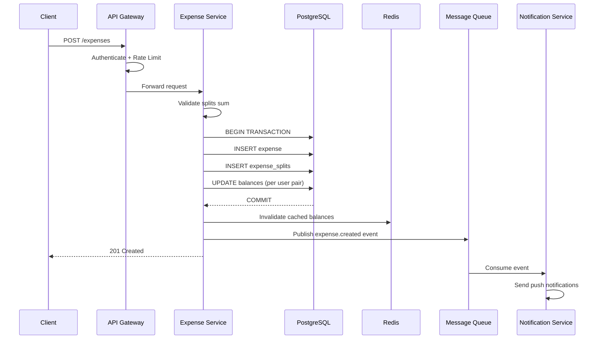
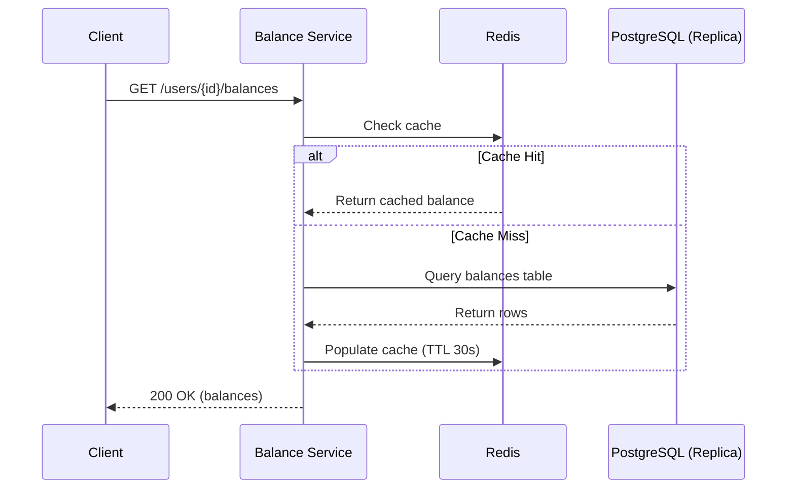
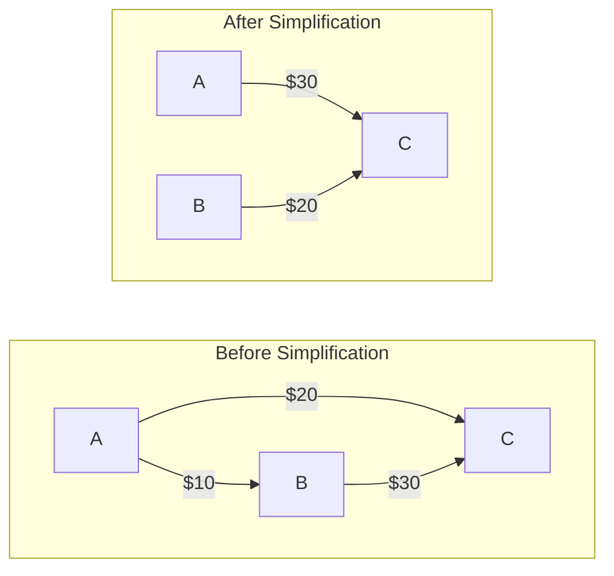

# Design Splitwise

## Interview Time Structure

| Time Slot | Phase | Focus |
|-----------|-------|-------|
| 0–10 min | Requirement Clarification | Scope, constraints, assumptions |
| 10–20 min | Core Entities & Data Modeling | Schema, relationships |
| 20–30 min | API Design | Key endpoints |
| 30–45 min | High-Level System Design | Architecture, data flow |
| 45–55 min | Deep Dives | Scaling, trade-offs, edge cases |
| 55–60 min | Summary + Improvements | Wrap-up |

---

## Phase 1: Requirement Clarification (0–10 min)

### Functional Requirements

1. **User Management** — Users can register, log in, and manage profiles.
2. **Group Management** — Create groups, add/remove members.
3. **Add Expenses** — A user can add an expense and split it among group members.
4. **Split Types** — Support equal, exact amount, and percentage splits.
5. **View Balances** — Users can see who owes them and whom they owe.
6. **Debt Simplification** — Minimize number of transactions to settle all debts.
7. **Settle Up** — Record that a payment has been made between two users.
8. **Transaction History** — View all past expenses and settlements.
9. **Notifications** — Notify users when they are added to an expense or reminded to pay.

### Non-Functional Requirements

1. **Consistency** — Financial data must be strongly consistent (no lost or duplicate debts).
2. **Availability** — System should be highly available for reads (balances, history).
3. **Low Latency** — Balance queries should return in < 200ms.
4. **Scalability** — Support 50M+ users, 500M+ expenses.
5. **Durability** — Zero data loss for financial records.

### Constraints & Assumptions

- This is **not** a real payment gateway — we only track who owes whom.
- A single expense can involve at most ~50 people (group limit).
- No currency conversion in V1 — single currency per group.
- Users are authenticated (JWT/OAuth assumed).

---

### Interviewer Cross-Questions (Phase 1)

> **Q: "Should we support recurring expenses?"**
> A: Out of scope for V1. Mention it as a future enhancement.

> **Q: "Do we need real-time updates?"**
> A: Near real-time is fine. Push notifications + eventual consistency for the activity feed is acceptable. Balances must be strongly consistent.

> **Q: "What happens if someone leaves a group with pending debts?"**
> A: Debts persist. The user can be removed from future expenses but existing balances remain until settled.

> **Q: "Why did you choose strong consistency for balances?"**
> A: Financial data requires correctness. An incorrect balance could lead to disputes. We cannot show User A owes $50 on one device and $30 on another.

---

## Phase 2: Back-of-the-Envelope Estimation

| Metric | Estimate |
|--------|----------|
| Total Users | 50M |
| DAU | 5M |
| Avg expenses/day | 10M |
| Avg group size | 4 people |
| Expense record size | ~500 bytes |
| Daily write volume | 10M × 500B = ~5 GB/day |
| Read:Write ratio | 10:1 (users check balances more than add expenses) |
| Storage (1 year) | ~1.8 TB expenses + metadata |

### QPS Estimates

- **Writes (new expenses):** 10M/day ≈ ~115 writes/sec (avg), peak ~500/sec
- **Reads (balance/history):** ~1150 reads/sec avg, peak ~5000/sec

> This is comfortably handled by a single sharded DB cluster. No need for extreme distributed systems yet, but we design for horizontal scaling.

---

### Interviewer Cross-Questions (Estimation)

> **Q: "Is 115 writes/sec really the peak?"**
> A: No, that's average. Peak could be 5-10x during end-of-month settlements or after group trips. We design for ~1000 writes/sec peak.

> **Q: "Would you cache balances?"**
> A: Yes, a materialized balance cache per user-pair reduces read load significantly.

---

## Phase 3: Core Entities & Data Modeling (10–20 min)

### Entities

1. **User** — id, name, email, phone
2. **Group** — id, name, created_by, created_at
3. **GroupMember** — group_id, user_id, joined_at
4. **Expense** — id, group_id, paid_by, total_amount, split_type, description, created_at
5. **ExpenseSplit** — id, expense_id, user_id, owed_amount
6. **Balance** — user_id_1, user_id_2, net_amount (materialized/derived)
7. **Settlement** — id, from_user, to_user, amount, settled_at

### Relationships



### Schema Design (PostgreSQL)

```sql
-- Users
CREATE TABLE users (
    id          BIGSERIAL PRIMARY KEY,
    name        VARCHAR(100) NOT NULL,
    email       VARCHAR(255) UNIQUE NOT NULL,
    phone       VARCHAR(20),
    created_at  TIMESTAMP DEFAULT NOW()
);

-- Groups
CREATE TABLE groups (
    id          BIGSERIAL PRIMARY KEY,
    name        VARCHAR(200) NOT NULL,
    created_by  BIGINT REFERENCES users(id),
    created_at  TIMESTAMP DEFAULT NOW()
);

-- Group Members
CREATE TABLE group_members (
    group_id    BIGINT REFERENCES groups(id),
    user_id     BIGINT REFERENCES users(id),
    joined_at   TIMESTAMP DEFAULT NOW(),
    PRIMARY KEY (group_id, user_id)
);

-- Expenses
CREATE TABLE expenses (
    id          BIGSERIAL PRIMARY KEY,
    group_id    BIGINT REFERENCES groups(id),
    paid_by     BIGINT REFERENCES users(id),
    amount      DECIMAL(12,2) NOT NULL,
    split_type  VARCHAR(20) NOT NULL, -- 'EQUAL', 'EXACT', 'PERCENTAGE'
    description VARCHAR(500),
    created_at  TIMESTAMP DEFAULT NOW()
);

-- Expense Splits (who owes what from a specific expense)
CREATE TABLE expense_splits (
    id          BIGSERIAL PRIMARY KEY,
    expense_id  BIGINT REFERENCES expenses(id),
    user_id     BIGINT REFERENCES users(id),
    amount      DECIMAL(12,2) NOT NULL  -- how much this user owes
);

-- Settlements (actual payments between users)
CREATE TABLE settlements (
    id          BIGSERIAL PRIMARY KEY,
    from_user   BIGINT REFERENCES users(id),
    to_user     BIGINT REFERENCES users(id),
    amount      DECIMAL(12,2) NOT NULL,
    group_id    BIGINT REFERENCES groups(id),
    settled_at  TIMESTAMP DEFAULT NOW()
);

-- Materialized Balances (net balance between two users)
-- Convention: user_id_low < user_id_high, positive amount means low owes high
CREATE TABLE balances (
    user_id_low     BIGINT REFERENCES users(id),
    user_id_high    BIGINT REFERENCES users(id),
    net_amount      DECIMAL(12,2) DEFAULT 0,
    updated_at      TIMESTAMP DEFAULT NOW(),
    PRIMARY KEY (user_id_low, user_id_high)
);
```

### Why Materialized Balances?

Instead of computing net balance from all historical expenses every time (expensive aggregation), we maintain a `balances` table that gets updated on every expense/settlement. This gives O(1) reads for balance queries.

---

### Interviewer Cross-Questions (Data Model)

> **Q: "Why not use a NoSQL database?"**
> A: Financial data benefits from ACID transactions. When adding an expense, we insert into `expenses`, `expense_splits`, AND update `balances` — all atomically. PostgreSQL handles this naturally.

> **Q: "How do you handle the balance direction?"**
> A: Convention: always store (lower_user_id, higher_user_id). Positive `net_amount` means lower owes higher. Negative means higher owes lower. This avoids duplicate rows.

> **Q: "What index strategy?"**
> A: Key indexes:
> - `balances(user_id_low)` and `balances(user_id_high)` for "show all my balances"
> - `expenses(group_id, created_at DESC)` for group expense history
> - `expense_splits(user_id)` for "expenses involving me"

> **Q: "Won't the balances table have write contention?"**
> A: For a given user pair, yes. But conflicts are rare — how often do two people add expenses between the same pair simultaneously? We use optimistic locking (version column) or SELECT FOR UPDATE.

---

## Phase 4: API Design (20–30 min)

### 1. Add Expense

```
POST /api/v1/expenses

Request:
{
  "group_id": 123,
  "paid_by": 1001,
  "amount": 600.00,
  "split_type": "EQUAL",
  "description": "Dinner at Italian place",
  "splits": [
    {"user_id": 1001, "amount": 200.00},
    {"user_id": 1002, "amount": 200.00},
    {"user_id": 1003, "amount": 200.00}
  ]
}

Response: 201 Created
{
  "expense_id": 5001,
  "balances_updated": true
}
```

### 2. Get Balances for User

```
GET /api/v1/users/{user_id}/balances

Response: 200 OK
{
  "user_id": 1001,
  "balances": [
    {"with_user": 1002, "amount": -150.00, "you_owe": true},
    {"with_user": 1003, "amount": 300.00, "they_owe": true}
  ],
  "total_owed_to_you": 300.00,
  "total_you_owe": 150.00
}
```

### 3. Settle Up

```
POST /api/v1/settlements

Request:
{
  "from_user": 1002,
  "to_user": 1001,
  "amount": 150.00,
  "group_id": 123
}

Response: 201 Created
{
  "settlement_id": 8001,
  "new_balance": 0.00
}
```

### 4. Get Group Expenses

```
GET /api/v1/groups/{group_id}/expenses?page=1&limit=20

Response: 200 OK
{
  "expenses": [
    {
      "id": 5001,
      "paid_by": {"id": 1001, "name": "Alice"},
      "amount": 600.00,
      "description": "Dinner at Italian place",
      "split_type": "EQUAL",
      "created_at": "2025-12-01T19:30:00Z"
    }
  ],
  "pagination": {"page": 1, "total_pages": 5}
}
```

### 5. Create Group

```
POST /api/v1/groups

Request:
{
  "name": "Goa Trip 2025",
  "members": [1001, 1002, 1003, 1004]
}

Response: 201 Created
{
  "group_id": 123,
  "name": "Goa Trip 2025",
  "member_count": 4
}
```

### 6. Get Simplified Debts (for a group)

```
GET /api/v1/groups/{group_id}/simplified-debts

Response: 200 OK
{
  "transactions": [
    {"from": 1002, "to": 1001, "amount": 250.00},
    {"from": 1003, "to": 1004, "amount": 100.00}
  ],
  "total_transactions": 2
}
```

---

### Interviewer Cross-Questions (API Design)

> **Q: "How do you validate that splits add up to the total?"**
> A: Server-side validation. For EQUAL split, we compute server-side. For EXACT/PERCENTAGE, we verify sum == total before persisting. Return 400 if mismatch.

> **Q: "What about idempotency?"**
> A: Client sends an `Idempotency-Key` header. We store it and reject duplicates within a TTL window. Critical for preventing double-charge on retries.

> **Q: "How do you handle partial failures?"**
> A: The expense creation (insert expense + splits + update balances) is wrapped in a DB transaction. Either everything succeeds or nothing does.

---

## Phase 5: High-Level System Design (30–45 min)

### Architecture Components



### Component Responsibilities

| Component | Responsibility |
|-----------|---------------|
| **API Gateway** | Auth, rate limiting, routing |
| **Expense Service** | Create/read expenses, validate splits, update balances |
| **Balance Service** | Query net balances, compute simplified debts |
| **Group Service** | CRUD groups and memberships |
| **Notification Service** | Async push notifications, email reminders |
| **PostgreSQL** | Source of truth for all financial data |
| **Redis Cache** | Cache frequently accessed balances |
| **Message Queue** | Decouple notifications from critical path |

### Data Flow: Adding an Expense



1. Client sends `POST /expenses` to API Gateway.
2. Gateway authenticates, routes to Expense Service.
3. Expense Service validates request (splits sum check, user membership).
4. **Within a DB transaction:**
   - Insert into `expenses` table.
   - Insert rows into `expense_splits`.
   - Update `balances` table for each affected user pair.
5. Invalidate Redis cache for affected user pairs.
6. Publish event to message queue → Notification Service sends push to affected users.
7. Return success to client.

### Data Flow: Reading Balances



1. Client sends `GET /users/{id}/balances`.
2. Balance Service checks Redis cache first.
3. Cache hit → return immediately.
4. Cache miss → query `balances` table (or read replica), populate cache, return.

### Debt Simplification Algorithm

The debt simplification problem: Given N users with various debts, find the minimum number of transactions to settle all debts.

**Algorithm (Greedy approach):**

1. Compute net balance for each user in the group (sum of all they're owed minus all they owe).
2. Separate into creditors (positive net) and debtors (negative net).
3. Sort both lists by absolute amount (descending).
4. Match largest debtor with largest creditor:
   - Transfer min(|debt|, |credit|).
   - Reduce both accordingly.
   - Remove anyone who reaches zero.
5. Repeat until all settled.

**Example:**
- A owes $30 net, B owes $20 net, C is owed $50 net.
- Instead of 4 individual transactions, simplified: A→C $30, B→C $20 (2 transactions).



> **Note:** Finding the true minimum is NP-hard. The greedy approach gives a good approximation. For small groups (≤50), we can even try subset-sum optimizations.

---

### Interviewer Cross-Questions (HLD)

> **Q: "Why separate Expense Service and Balance Service?"**
> A: Separation of concerns. Expense Service handles writes (high consistency needs). Balance Service handles reads (can use caching aggressively). Different scaling profiles.

> **Q: "What if Redis cache is stale?"**
> A: We invalidate on write. For extra safety, cache entries have a short TTL (30s). Worst case, user sees stale balance for 30 seconds — acceptable since actual DB is always correct.

> **Q: "Why not compute balances on the fly from expense_splits?"**
> A: For a user with 1000+ expenses, aggregating all splits on every balance query is expensive (O(N) per query). Materialized balance gives O(1) reads at the cost of slightly more complex writes.

> **Q: "How does the simplified debt algorithm work in real-time?"**
> A: It's computed on-demand when requested, not stored. For a group of ≤50 users, the computation is trivial (< 1ms). We can cache the result and invalidate when any expense in that group changes.

---

## Phase 6: Deep Dives (45–55 min)

### 6.1 Scaling Strategies

**Database Sharding:**
- Shard by `user_id` for the balances table.
- Shard by `group_id` for expenses (all expenses in a group live together).
- Challenge: balance lookups span two user shards → use consistent hashing on `min(user1, user2)` to colocate.

**Read Replicas:**
- Transaction history and group expense list can read from replicas.
- Balance queries prefer primary (or cache) for freshness.

**Caching Layer:**
- Redis stores `balance:{user1}:{user2}` → net_amount.
- Cache invalidation on every write via pub/sub.

**Horizontal Scaling:**
- Expense Service is stateless → scale horizontally behind LB.
- DB connection pooling via PgBouncer.

### 6.2 Consistency vs Availability Decisions

| Operation | Consistency Level | Why |
|-----------|-------------------|-----|
| Add expense | Strong (ACID txn) | Financial correctness is mandatory |
| Read balance | Strong (prefer primary) | Users compare balances — must match |
| Read expense history | Eventual (read replica OK) | Slight lag acceptable |
| Notifications | Eventual | Best effort, async |
| Debt simplification | Eventual | Computed view, can lag by seconds |

### 6.3 Edge Cases

1. **Rounding errors in equal splits:**
   - $100 split 3 ways = $33.33, $33.33, $33.34 (last person absorbs remainder).
   - Always use DECIMAL, never floating point.

2. **Concurrent expense additions between same users:**
   - Use `SELECT FOR UPDATE` on the balance row.
   - Or use optimistic locking with a version column.

3. **User deletes account with pending balance:**
   - Soft-delete only. Balance records persist. Must settle before true deletion.

4. **Expense edited/deleted after creation:**
   - Reverse the balance impact of the old expense, apply the new one — all in a transaction.
   - Maintain audit log of edits.

5. **Group with 50 people, one expense:**
   - 50 `expense_splits` rows + up to 49 balance updates. Batch the balance updates in one transaction.

6. **Negative settlements (overpayment):**
   - Validation: settlement amount ≤ outstanding balance. Reject overpayments.

### 6.4 Failure Handling

- **DB write failure mid-transaction:** Transaction rolls back. No partial state.
- **Cache invalidation fails:** TTL ensures eventual correctness. Log the failure for monitoring.
- **Notification service down:** Messages queue up in Kafka. Processed when service recovers.
- **Network partition between services:** Expense creation is synchronous DB call. If DB is unreachable, return 503 — do NOT create expense in an eventually-consistent manner.

---

### Interviewer Cross-Questions (Deep Dive)

> **Q: "How would you handle multi-currency?"**
> A: Store currency per expense. Balances are per-currency per user pair. When displaying, convert to user's preferred currency using a rates service. Never mix currencies in arithmetic.

> **Q: "What if debt simplification gives a different result than individual balances?"**
> A: Simplified debts are a **view** on top of actual balances. Total money flow must equal sum of all pair-wise balances in the group. We validate this invariant.

> **Q: "How do you prevent a malicious user from adding fake expenses?"**
> A: Authorization checks — only group members can add expenses. Optional: require approval from other participants before expense is finalized (V2 feature). Rate limiting per user.

> **Q: "What monitoring would you add?"**
> A: 
> - Alert on balance inconsistencies (periodic reconciliation job).
> - Track p99 latency on expense creation.
> - Monitor cache hit ratio (should be > 90%).
> - Dead letter queue size for failed notifications.

---

## Phase 7: Trade-offs Discussion

| Decision | Chosen | Alternative | Why |
|----------|--------|-------------|-----|
| SQL vs NoSQL | PostgreSQL | DynamoDB | ACID transactions critical for financial data |
| Materialized balances | Yes | Compute on read | O(1) reads, acceptable write complexity |
| Microservices | Yes (3 services) | Monolith | At this scale, clear domain boundaries justify it |
| Debt simplification | Greedy algorithm | Optimal (NP-hard) | Good enough for groups ≤ 50. Optimal is overkill |
| Notifications | Async (Kafka) | Sync (in-request) | Don't block expense creation on notification delivery |
| Cache | Redis with short TTL | No cache | 10:1 read-write ratio makes caching worthwhile |
| Sharding key | group_id for expenses | user_id | Most queries are within a group context |

---

## Phase 8: Final Summary (55–60 min)

### Key Points to Reiterate

1. **Core challenge:** Maintaining consistent financial balances while supporting flexible split types.
2. **Data model choice:** Relational DB with materialized balances for fast reads.
3. **Consistency guarantee:** ACID transactions for all write operations that touch money.
4. **Scaling approach:** Read replicas + Redis cache for reads; sharding by group_id for writes.
5. **Debt simplification:** Greedy algorithm, computed on-demand, adequate for practical group sizes.

### Future Enhancements (Mention Briefly)

- Recurring expenses (cron-triggered expense creation)
- Multi-currency with live exchange rates
- Expense receipts (image upload to S3)
- ML-based expense categorization
- Activity feed with real-time WebSocket updates
- Export to PDF/CSV

### What Makes This Answer SDE-2 Level

- Clear requirements before jumping to design
- Practical estimation (not over-engineered)
- Strong schema design with reasoning
- Explicit consistency vs availability trade-offs
- Awareness of edge cases (rounding, concurrency)
- Pragmatic algorithm choice (greedy vs optimal)

---

## Quick Revision Checklist

- [ ] Clarify scope: expense tracking, NOT payment processing
- [ ] Split types: equal, exact, percentage
- [ ] Materialized balances → O(1) reads
- [ ] ACID transactions for expense creation
- [ ] Debt simplification = greedy matching of creditors/debtors
- [ ] Cache invalidation on writes, short TTL as safety net
- [ ] Shard by group_id, replicate for reads
- [ ] Async notifications via message queue
- [ ] Edge cases: rounding, concurrent writes, deletions
